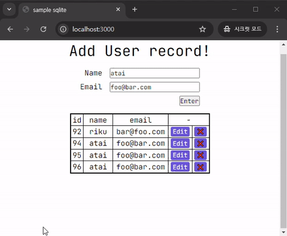

# Simple CRUD App with Elysia JS + HTMX + Drizzle(Sqlite)

## Explanation

This is a simple CRUD app that uses Elysia JS, HTMX and Drizzle(Sqlite) to store user data.

This project is written in TypeScript and runs with [Bun](https://bun.sh/) toolkit.

[Elysia JS](https://elysiajs.com/) can response with JSX with `@elysia/html` plugin, which enables comfortable typing experience. (Rather than using raw HTML strings inside TypeScript files.)

> Some of plugins of Elysia JS are used.
> - `@elysiajs/html` is used to write JSX. 
> - `@elysiajs/static` is used to serve static files.
> - `logixlysia` logs pretty messages to the console.

[HTMX](https://htmx.org/) helps AJAX requests without writing JavaScript code. When the server responses with HTML, HTMX just swaps the target with that response.

[Drizzle](https://orm.drizzle.team/) is an ORM(Object-Relational Mapping) library that helps to interact with the database. It is a simple and easy-to-use library.

### API Endpoints

Endpoints are defined in `src/api/user.ts` file.

- `GET /users`: Get all users from the database.
    - `GET /users/:id`: Get a user by id. Used when editing a user.
- `POST /users`: Create a new user.
    - Always remember to **sanitize** the input from user in order to prevent XSS(Cross Site Scripting) attacks.
- `DELETE /users/:id`: Delete a user by id.

## Running
To start the development server run:
```bash
bun install
bun run dev
```

Open http://localhost:3000/ with your browser to see the result.

## Demo
